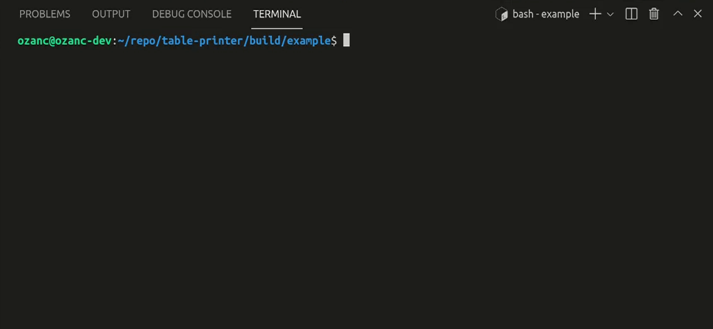

<p align="center">
   
</p>

# tableprinter
Allows a programmer to print table-like outputs over `std::ostream`.

It is a header only library.

No other dependency than STL.

Provides required files for cmake to be used with `find_package( tableprinter )`

C++17 compliant compiler is needed to make it worked.

Tested only on Linux.

## Example

``` C++
#include <iostream>
#include <sstream>
#include <tableprinter/tableprinter.hpp>

int main()
{
    using namespace tableprinter;

    std::stringstream ss;

    printer p
    {
        {
            { name { "id" }      , width { 4 }  } ,
            { name { "name" }    , width { 10 } } ,
            { name { "surname" } , width { 10 } } ,
            { name { "rank" }    , width { 6 }  } ,
            { name { "score" }   , width { 7 } , fixed { } , precision { 2 } }
        } ,
        { std::cout , ss }
    };

    p.sanity_check()
     .echo( "The scores are listed below with their ranks :" )
     .print_headers()
     .print( 1 , "Lucy"   , "Ballmer"  , 2 , 94.13 )
     .print( 2 , "Roger"  , "Bacon"    , 5 , 77.13 )
     .print( 3 , "Anna"   , "Smith"    , 3 , 87.13 )
     .print( 4 , "Robert" , "Schwartz" , 1 , 98.34 )
     .print( 5 , "Robert" , "Brown"    , 4 , 84.34 )
     .print( std::make_tuple( 6 , "David" , "Timothy" , 6 , 71.34 ) );

    /*
       # Run the command if you want to see maximum score
       ./print-scores | tail -n 5 | awk '{ printf "%d %d %s %s %f\n" , $4 , $1 , $2 , $3 , $5 }' | sort | head -n 1 | awk '{ print $5 }'
       # or lowest score
       ./print-scores | tail -n 5 | awk '{ printf "%d %d %s %s %f\n" , $4 , $1 , $2 , $3 , $5 }' | sort | tac | head -n 1 | awk '{ print $5 }'
    */
}
```

```console
The scores are listed below with their ranks :
  id      name   surname  rank  score
   1      Lucy   Ballmer     2  94.13
   2     Roger     Bacon     5  77.13
   3      Anna     Smith     3  87.13
   4    Robert  Schwartz     1  98.34
   5    Robert     Brown     4  84.34
   6     David   Timothy     6  71.34
```

## How to use ?
### Way 1. Install to the system
- Install __tableprinter__ as system-wide.
```bash
cd $(mktemp -d)
git clone https://github.com/OzanCansel/tableprinter.git
cd tableprinter
mkdir build && cd build
cmake ..
sudo cmake --build . --target install -- -j$(nproc)
```


#### Way 1.1.
- Include __tableprinter__ to your cmake project with `find_package( tableprinter )`
``` cmake
cmake_minimum_required( VERSION 3.10 )
project( my_project )

# Allows you to use tableprinter
find_package( tableprinter REQUIRED )

add_executable( my_binary main.cpp )

target_link_libraries( my_binary PRIVATE tableprinter::tableprinter )
```

#### Way 1.2.
- It is not obliged to be included by a cmake project. tableprinter is header only so it will be visible after it is installed to the system. So just include it and make sure that you enabled C++17 standard.

### Way 2. Add as a subdirectory
- Add as an subdirectory to your existing cmake project.

```bash
cd already_existing_project
git clone https://github.com/OzanCansel/tableprinter.git
```
``` cmake
cmake_minimum_required( VERSION 3.10 )
project( already_existing_project )

# Allows you to use tableprinter
add_subdirectory( tableprinter EXCLUDE_FROM_ALL )

add_executable( my_binary main.cpp )

target_link_libraries( my_binary PRIVATE tableprinter::tableprinter )
```

#### Way 3.
Just download `tableprinter.hpp` and include it.

## Contributing
Pull requests are welcome. For major changes, please open an issue first to discuss what you would like to change.

Please make sure to update tests as appropriate.

## License
[MIT](https://raw.githubusercontent.com/OzanCansel/tableprinter/master/LICENSE)
